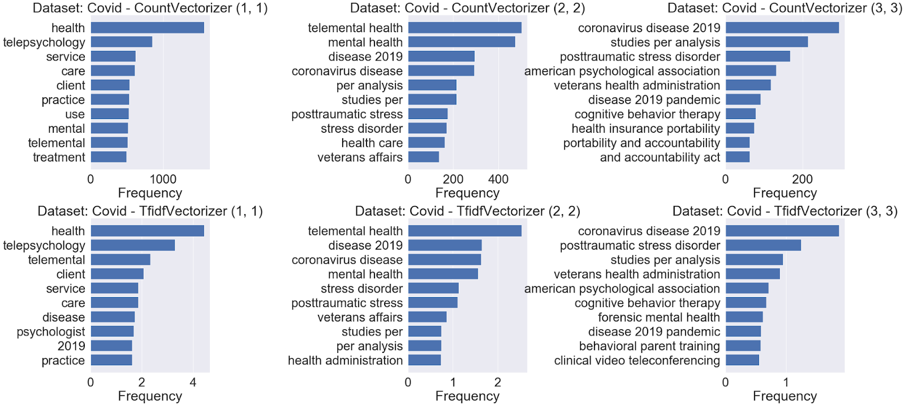

# Text_Summarization
UMBC Master's in Data Science Data690 - Conduct Text Summarization

# Project Overview

The COVID-19 Pandemic has led to a rapid shift from in-person to virtual work.

This shift has created an incredible demand for research on working in virtual environments.

In addition, the pandemic and other societal stressors have led to a mental health crisis in the US.

In order to obtain an unbiased understanding of the existing literature on telemental health and telepsychology,
as well as how COVID-19 has affected that literature, we used text summarization techniques including keyword extraction,
topic modelling, text similarity analysis and more to perform a review of the literature.

# Example Findings:

<h3>Frequency Counts Before the COVID-19 Pandemic: (2017-2019)</h3>

  
<h3>Frequency Counts During COVID-19 Pandemic: (2020-2021)</h3>

## Implementation Instructions
For the Implementation of the code we recommend to have the following libraries:

  - pandas
  - Matplotlib
  - String
  - Spacy
  - SciSpacy
  - Genism
  - Rake-nltk
  - sklearn
  - Pattern
  - Nltk
  - String
  - textwrap
  - json
