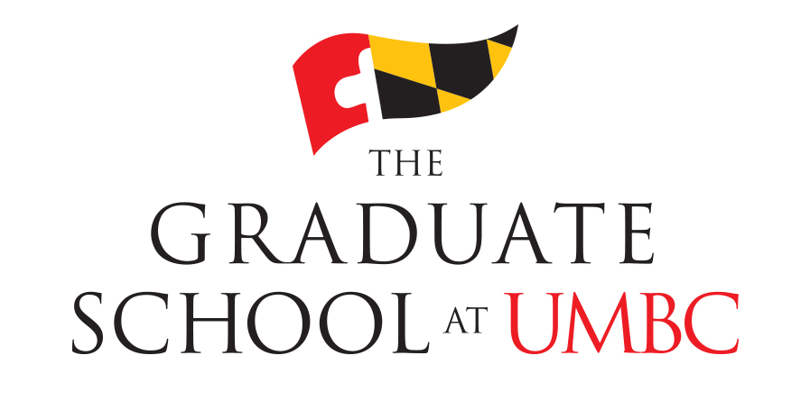
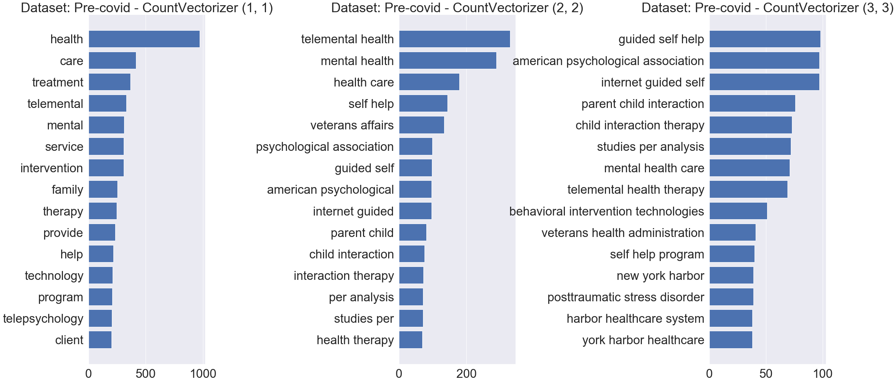
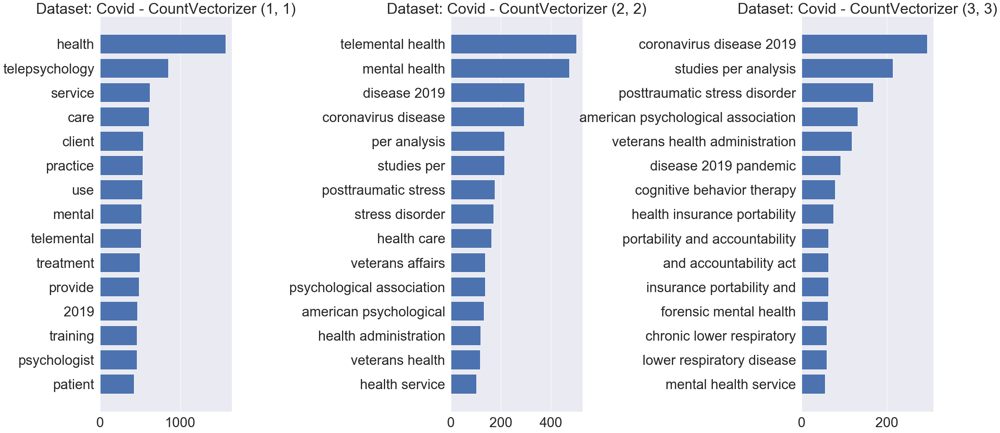

# Analyzing How Research on Telepsychology has Changed as a Result of the Coronavirus Pandemic 
### An Application of Natural Language Processing

Jessica C. Conroy, Daniel B. Babcock, Adam M. Goldstein, Yunpeng Li, Jinqing Liang, and Jorge Neyra
UMBC Master's in Data Science Data690

# Project Abstract

The Coronavirus pandemic has had a tremendous effect on all areas of life, perhaps the most salient being the rapid transition to remote life. This paper aims to understand how that shift has impacted academic work produced in the field of telepsychology. We used a variety of Natural Language Processing (NLP) techniques to explore keywords, named entities, topics, and more across articles published between 2016 and 2021. Furthermore, we compared the results for those articles published before 2020 and the outbreak of the COVID-19 Pandemic with those published during the pandemic in order to find the changes that have occurred as a result. We identified three major groups in the literature: 1. Implementation, barriers, and evidence-based treatment; 2. Training and ethics; and 3. Covid-19 and Stress related disorders. We also identified major shifts during the pandemic towards discussing stress and stress-related disorders and away from discussing depression and self-help technologies. This paper summarizes some of the existing research on telemental health and provides a model for systematically applying NLP to identify trends in literature.

In order to obtain an unbiased understanding of the existing literature on telemental health and telepsychology,
as well as how COVID-19 has affected that literature, we used text summarization techniques including keyword extraction,
topic modelling, text similarity analysis and more to perform a review of the literature.

Keywords: Telepsychology, telemental health, NLP, NER, Topic Modeling, Text Mining, Covid-19, NMF 

# Project Framework

    

# Example Findings:

Frequency Counts of Unigrams, Bigrams, and Trigrams Before the COVID-19 Pandemic: (2017-2019):

Frequency Counts of Unigrams, Bigrams, and Trigrams During the COVID-19 Pandemic: (2020-2021):

## Implementation Instructions
For the Implementation of the code we recommend to have the following libraries:

  - pandas
  - matplotlib
  - string
  - spacy
  - sciSpacy
  - genism
  - rake-nltk
  - sklearn
  - pattern
  - nltk
  - string
  - textwrap
  - json
  - rouge
